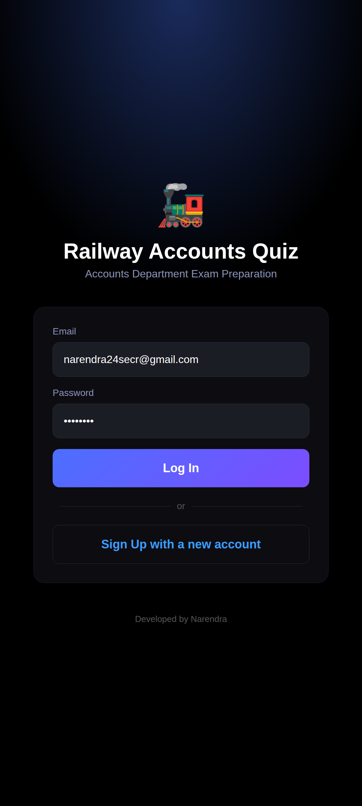
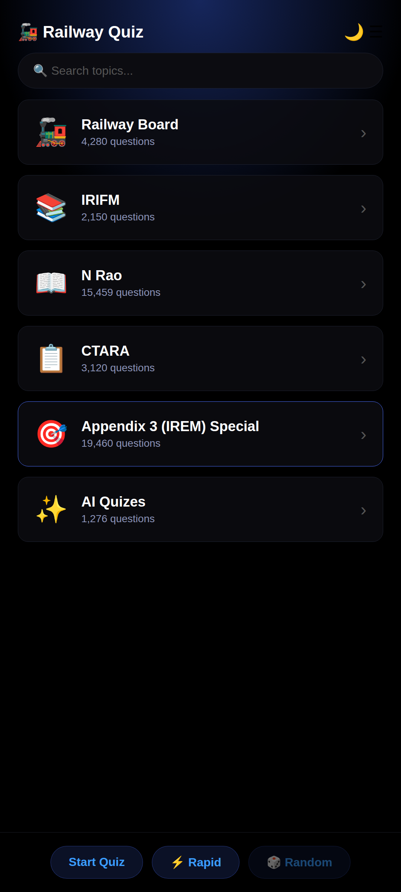
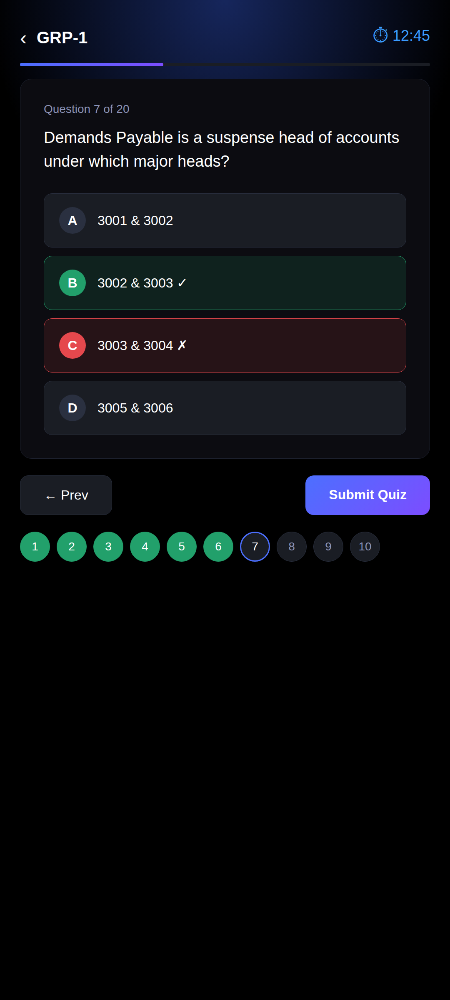
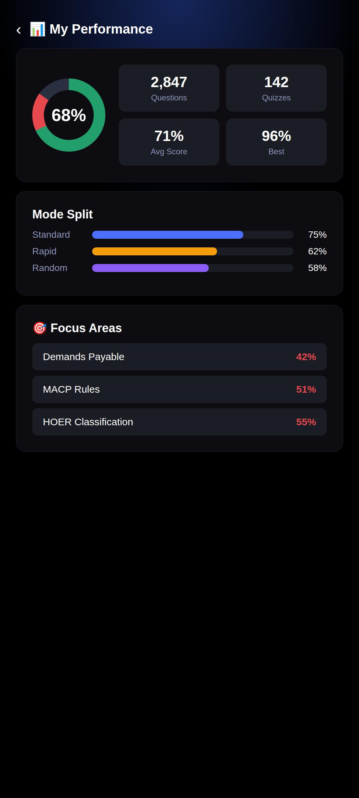
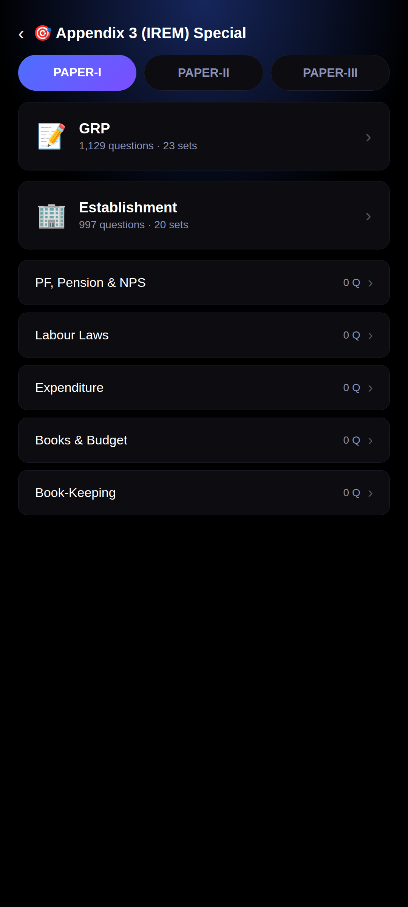
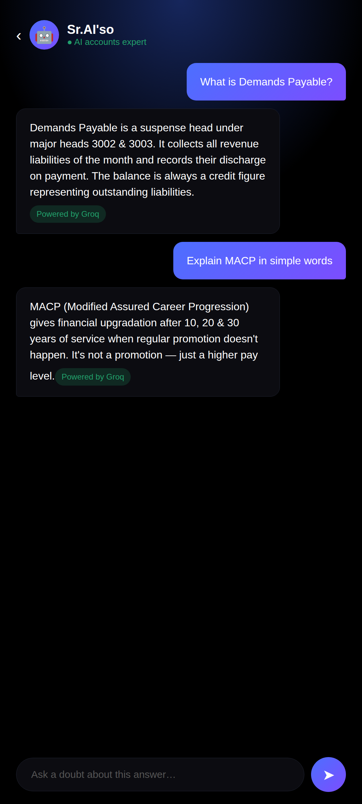

# 🚂 Railway Accounts Quiz App (Native)

Native Android app for **Railway Accounts Department** exam preparation — MCQs, theory reader, AI companion, forum, live quizzes.

- 📚 **30,000+ MCQs** across Railway Board, IRIFM, N Rao, CTARA & Accounts Department Exam
- 🎯 **Accounts Department Exam**: Paper-I (GRP, Establishment, Leave Rules, Pass Rules...), Paper-II, Paper-III
- ⚡ **Quiz modes**: Standard, Rapid-Fire & Random with per-question timers
- 🤖 **AI Assistant Sr.AI'so** — accounts expert chatbot with your own API keys
- 📊 **My Performance** — accuracy donut, score trends, focus areas
- 💬 **Forum**, 🏆 **Live Quiz**, 📝 **Misc Notes**
- 🌙 Day / Liquid Midnight themes

## 📥 Download

Get the latest APK from **[Releases](../../releases)** and install it on your Android phone. (You may need to allow "Install unknown apps" for your browser.)

Current version: **v1.0.1.720** (native)

## 🔐 Login

- **Sign Up** with email → lands on **Waiting for Approval** page
- Admin approves → Instagram-style verified badge animation → Home
- **Login** for approved users with the same verified animation (~0.7s)
- Banned users see an **Access Blocked** screen with inline Message Admin form
- Sessions survive reinstalls; expired access shows a clear message, not a logout

## 📊 My Performance

- **Accuracy donut** + 4 stat tiles (questions, quizzes, avg score, best)
- **Score-trend area graph** over time
- **Mode/activity/split bars** — Standard vs Rapid vs Random
- **Focus Areas** — weakest topics surfaced automatically
- **Recent Attempts** (7D / 10D / Overall) — tap any attempt for full review + Re-attempt

## 📑 App Sections (tabs)

| Section | What it does |
|---|---|
| 🏠 **Home** | Subject tiles (Railway Board, IRIFM, N Rao, CTARA, Accounts Department Exam) with glass-pill design; long-press to reorder/rename |
| 📝 **Quiz Setup** | Per-topic panel: Start Quiz (10/20/30/All questions), timer (No/30s/45s/1m/2m), Attempted/Remaining counts |
| ⚡ **Rapid-Fire** | 15/30s timer, instant answer reveal, auto-advance; no Submit button |
| 🎲 **Random Quiz** | Mixed questions across selected topics |
| 📚 **Topic Viewer** | Browse questions with 👁 Answers toggle; search; correct option highlighted |
| 🤖 **AI Assistant Sr.AI'so** | Floating AI buddy — explanations, doubts, Hindi translation; 4 providers (Free/Groq/Gemini/OpenAI) |
| 💬 **Forum** | Discussions with verified admin badge |
| 🏆 **Live Quiz** | Scheduled live quizzes with leaderboard + past quiz history |
| 📝 **Misc Notes** | PDF notes, subtopic-wise |
| 📊 **My Performance** | Graphs, trends, focus areas (see above) |
| 📜 **My Attempts** | Full history with per-attempt review + Re-attempt |
| ⚙️ **Drawer** | Day/Midnight toggle, access duration pill, Contact Us, About |

## 🤖 AI Assistant Sr.AI'so — API key based

Sr.AI'so, the in-app AI buddy, runs on your own API keys. Open AI chat → 🔑 **AI API Keys**, pick a provider, paste the key, press Save. Keys stay on your device only, never synced.

| Provider | Key | Notes |
|---|---|---|
| **Free** | No key needed | Default — works out of the box (Pollinations.ai) |
| **Groq** | Free key from `console.groq.com` | Starts with `gsk_` — very fast |
| **Gemini** | Free key from `aistudio.google.com` | Google AI Studio key |
| **OpenAI** | Key from `platform.openai.com` | Starts with `sk_` — uses `gpt-4o-mini` |

Your key powers: AI chat, 💡 Explain answer (bilingual), Hindi translation, and the doubt box under every explanation. Token usage tracked per provider with daily limits (💲 button in chat header).

## 📖 Offline explanations

Every question ships with a **bundled static explanation** that works with **no internet and no AI key**. AI explanations are fetched only when you tap 💡 Explain answer.

## 📸 Screenshots

| Login | Home | Quiz Question |
|---|---|---|
|  |  |  |

| My Performance | Paper-I | AI Assistant Sr.AI'so |
|---|---|---|
|  |  |  |

