# 🚂 Railway Accounts Quiz App

- MCQs across Railway Board, IRIFM, N. Rao & CTARA chapters
- Standard, Rapid-Fire & Random quiz modes with timers
- 📚 Theory reader, 🤖 Goku AI companion, 💬 Forum, 🏆 Live quizzes
- Works offline; progress syncs when online

## 📥 Download

Get the latest APK from **[Releases](../../releases)** and install it on your Android phone. (You may need to allow "Install unknown apps" for your browser.)

Current version: **v1.0.1.229**

## 📸 Screenshots

| Sign Up | Login | Waiting for Approval |
|---|---|---|
| 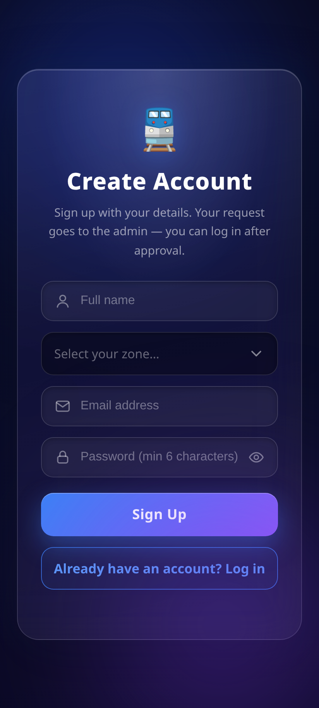 | 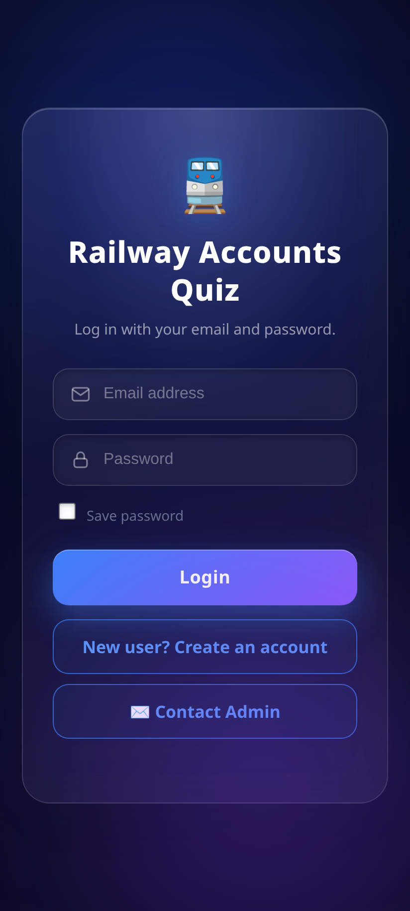 | 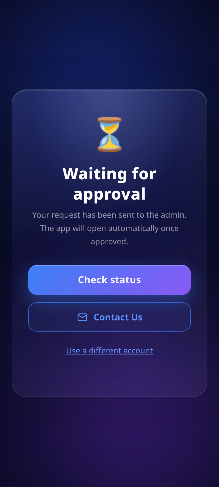 |

| Home | Quiz Question | Result |
|---|---|---|
| 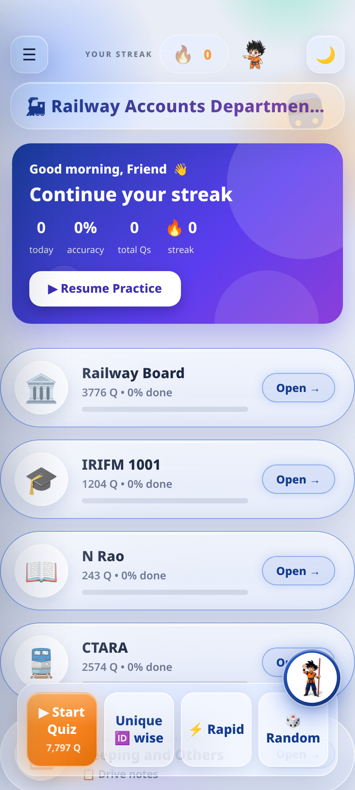 | 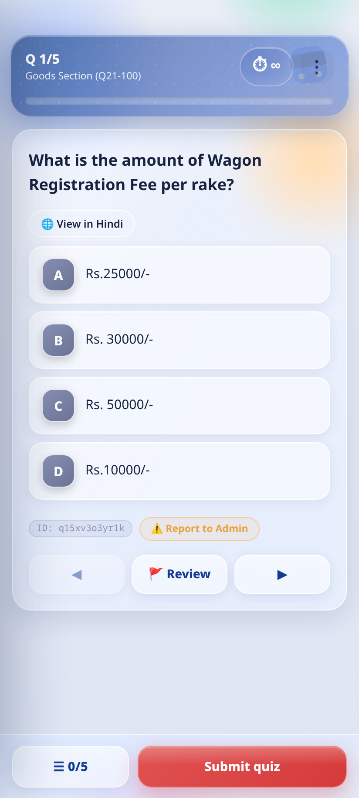 | 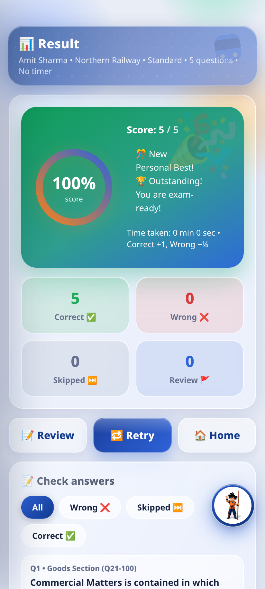 |

| Forum | Forum Discussion | Live Quiz |
|---|---|---|
| 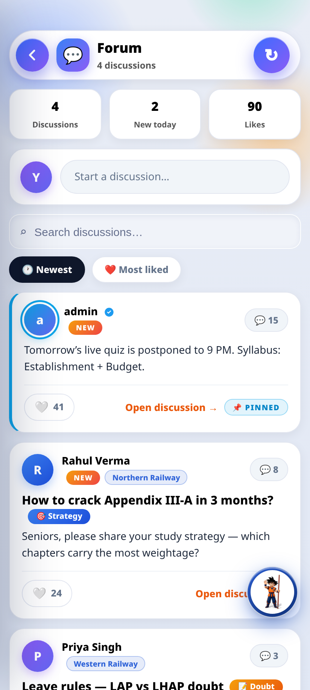 | 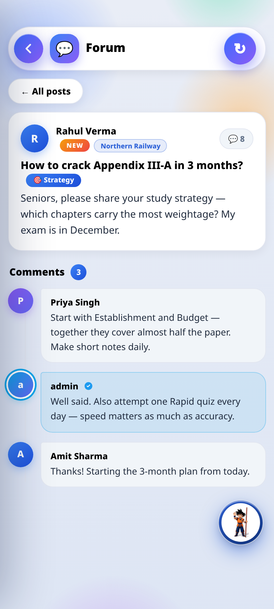 | 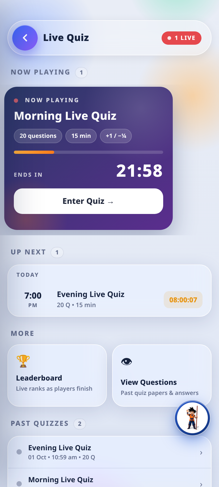 |

| Misc Notes | My Performance |
|---|---|
| 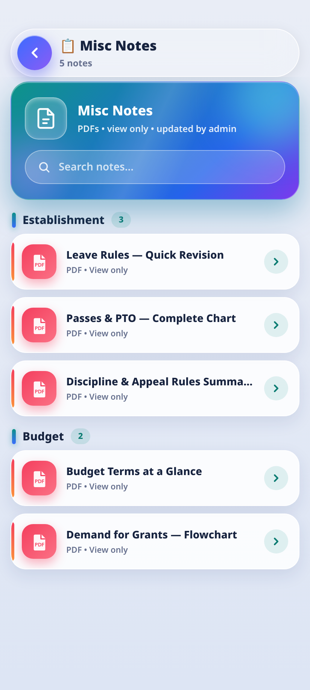 | 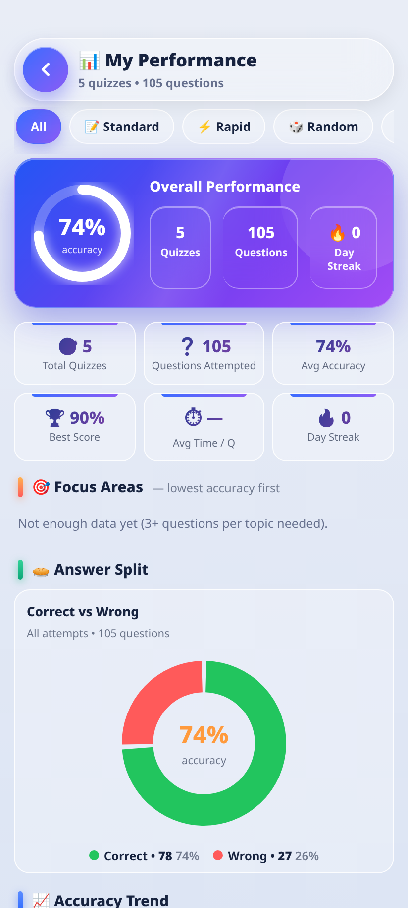 |

| AI API Keys | Goku AI Explanation (Groq) | Goku AI Explanation (OpenAI) | Offline Explanation |
|---|---|---|---|
| 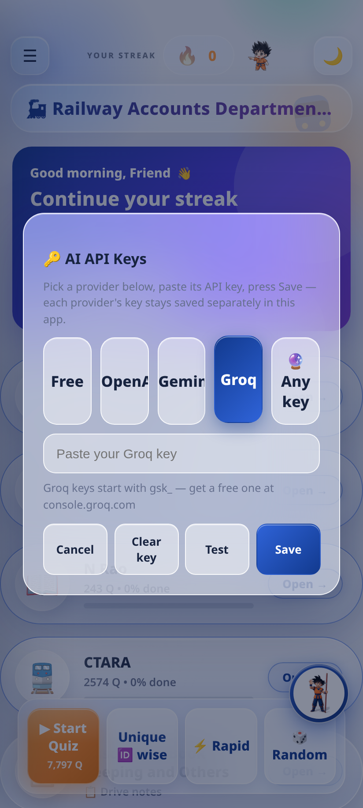 | 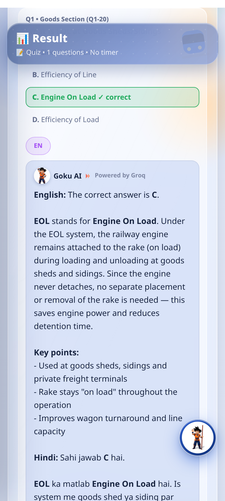 | 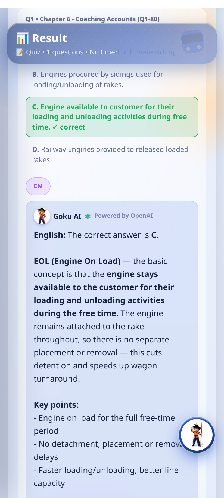 | 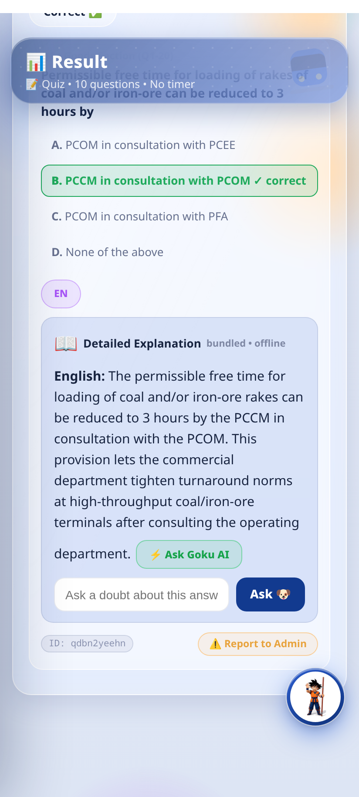 |

## 🤖 Goku AI — API key based

Goku, the in-app AI buddy, can run on your own API keys. Open Goku chat → 🔑 **AI API Keys**, pick a provider, paste the key, press Save. Keys stay saved in the app only, separately per provider.

| Provider | Key | Example |
|---|---|---|
| **Free** | No key needed | Default — works out of the box (Pollinations.ai) |
| **Groq** | Free key from `console.groq.com` | Starts with `gsk_` — very fast answers |
| **Gemini** | Free key from `aistudio.google.com` | Google AI Studio API key |
| **OpenAI** | Key from `platform.openai.com` | Starts with `sk_` — uses `gpt-4o-mini` |

Your key powers: Goku chat, full answer explanations (with a *Powered by …* badge), Hindi translation, and the doubt box under every explanation. Token usage is tracked per provider with daily limits (💲 button in Goku chat header).

## 📖 Offline explanations

Every question also ships with a **bundled static explanation** that works with **no internet and no AI key** — look for the *bundled • offline* badge. AI explanations are fetched only when you tap 💡 Explain answer on a question without one.
