

# 🚂 RADEQuiz — Railway Accounts Department Examination Quiz

Native Android app for **Railway Accounts Department** exam preparation — MCQs, theory reader, AI companion, forum, live quizzes.

- 📚 **30,000+ MCQs** across Railway Board, IRIFM, N Rao, CTARA & Accounts Department Exam
- 🎯 **Accounts Department Exam**: Paper-I (GRP, Establishment, Leave Rules, Pass Rules...), Paper-II, Paper-III
- ⚡ **Quiz modes**: Standard, Rapid-Fire & Random with per-question timers
- 🤖 **AI Assistant Sr.AI'so** — accounts expert chatbot with your own API keys
- 📊 **My Performance** — accuracy donut, score trends, focus areas
- 💬 **Forum**, 🏆 **Live Quiz**, 📝 **Misc Notes**
- 🌙 Day / Liquid Midnight themes

Current version: **v1.0.1.723** (native) — app name: **RADEQuiz**

## 🔐 Login

- **Sign Up** with email → lands on **Waiting for Approval** page
- Admin approves → smooth approval animation → Home
- **Login** for approved users with the same approval animation (~0.7s)
- Banned users see an **Access Blocked** screen with inline Message Admin form
- Sessions survive reinstalls; expired access shows a clear message, not a logout

## 📊 My Performance

- **Accuracy donut** + 4 stat tiles (questions, quizzes, avg score, best)
- **Score-trend area graph** over time
- **Mode/activity/split bars** — Standard vs Rapid vs Random
- **Focus Areas** — weakest topics surfaced automatically
- **Recent Attempts** (7D / 10D / Overall) — tap any attempt for full review + Re-attempt

## 📑 App Sections (tabs)

| Section | What it does |
|---|---|
| 🏠 **Home** | Subject tiles (Railway Board, IRIFM, N Rao, CTARA, Accounts Department Exam) with glass-pill design; long-press to reorder/rename |
| 📝 **Quiz Setup** | Per-topic panel: Start Quiz (10/20/30/All questions), timer (No/30s/45s/1m/2m), Attempted/Remaining counts |
| ⚡ **Rapid-Fire** | 15/30s timer, instant answer reveal, auto-advance; no Submit button |
| 🎲 **Random Quiz** | Mixed questions across selected topics |
| 📚 **Topic Viewer** | Browse questions with 👁 Answers toggle; search; correct option highlighted |
| 🤖 **AI Assistant Sr.AI'so** | Floating AI buddy — explanations, doubts, Hindi translation; 4 providers (Free/Groq/Gemini/OpenAI) |
| 💬 **Forum** | Discussions with verified admin badge |
| 🏆 **Live Quiz** | Scheduled live quizzes with leaderboard + past quiz history |
| 📝 **Misc Notes** | PDF notes, subtopic-wise |
| 📊 **My Performance** | Graphs, trends, focus areas (see above) |
| 📜 **My Attempts** | Full history with per-attempt review + Re-attempt |
| ⚙️ **Drawer** | Day/Midnight toggle, access duration pill, Contact Us, About |

## 🤖 AI Assistant Sr.AI'so — API key based

Sr.AI'so, the in-app AI buddy, runs on your own API keys. Open AI chat → 🔑 **AI API Keys**, pick a provider, paste the key, press Save. Keys stay on your device only, never synced.

| Provider | Key | Notes |
|---|---|---|
| **Free** | No key needed | Default — works out of the box (Pollinations.ai) |
| **Groq** | Free key from `console.groq.com` | Starts with `gsk_` — very fast |
| **Gemini** | Free key from `aistudio.google.com` | Google AI Studio key |
| **OpenAI** | Key from `platform.openai.com` | Starts with `sk_` — uses `gpt-4o-mini` |

Your key powers: AI chat, 💡 Explain answer (bilingual), Hindi translation, and the doubt box under every explanation. Token usage tracked per provider with daily limits (💲 button in chat header).

## 📖 Offline explanations

Every question ships with a **bundled static explanation** that works with **no internet and no AI key**. AI explanations are fetched only when you tap 💡 Explain answer.

## 📸 Screenshots

### 🔐 Login & Sign Up
Sign up with email → **Waiting for Approval** page → admin approves → smooth approval animation → Home.

| Login | Sign Up | Waiting for Approval | Logged In |
|---|---|---|---|
| 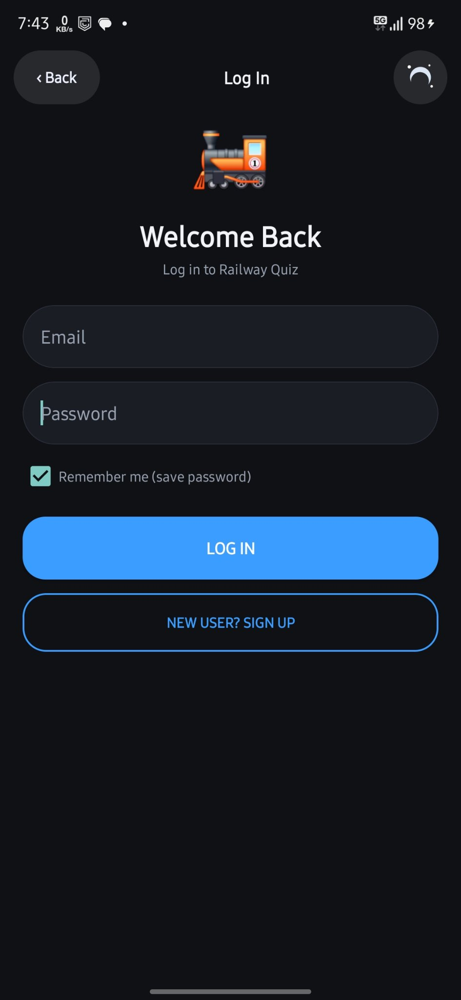 | 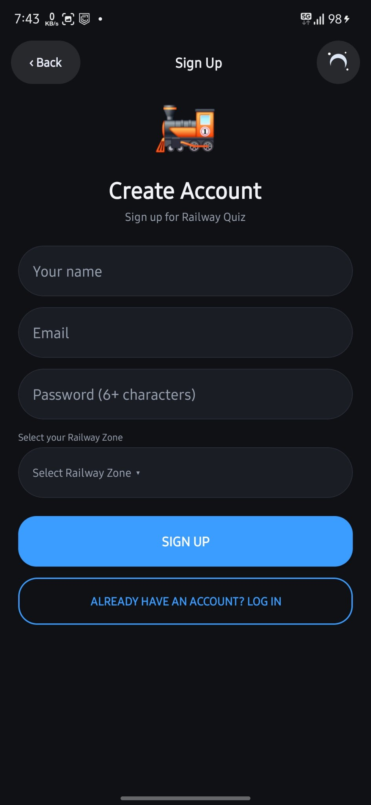 | 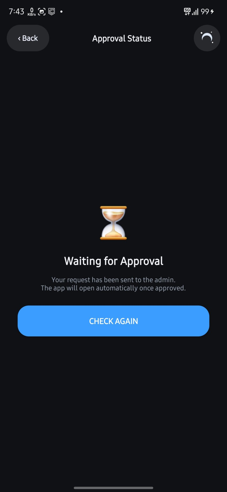 | 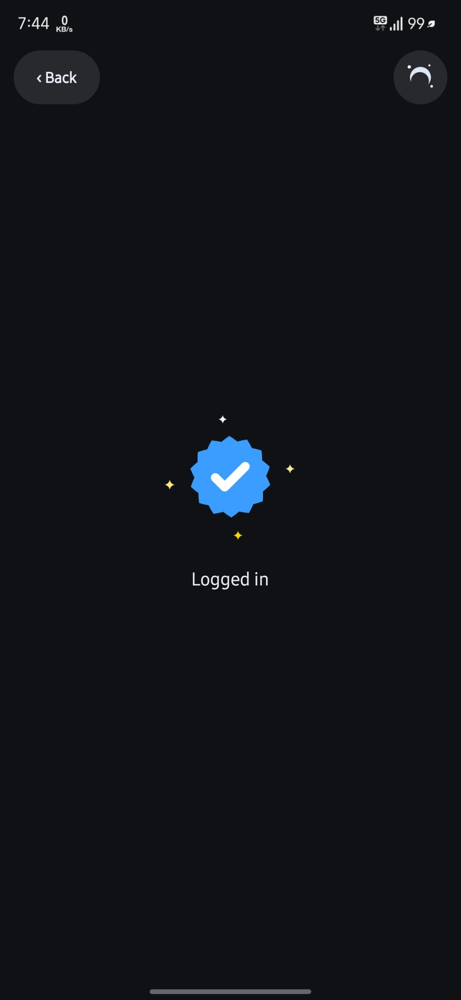 |

### 🏠 Home — Midnight & Day
Streak card (today's questions, accuracy, total Qs, day streak), **▶ RESUME PRACTICE**, live quiz countdown, and subject tiles with progress bars. Toggle **🌊 Liquid Midnight** / **☀️ Day** from the top bar.

| Home — Midnight | Home — Day |
|---|---|
| 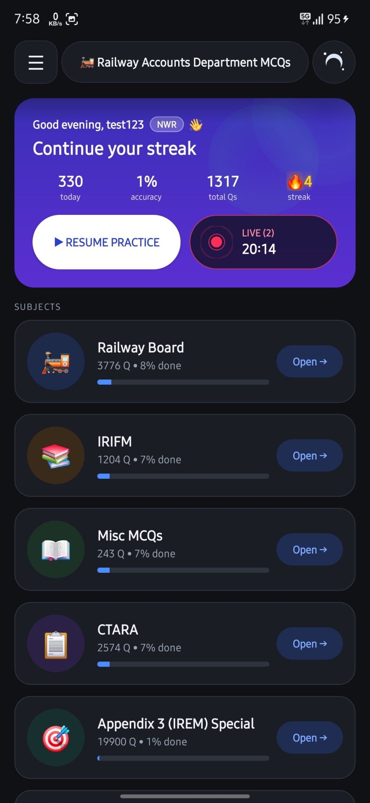 | 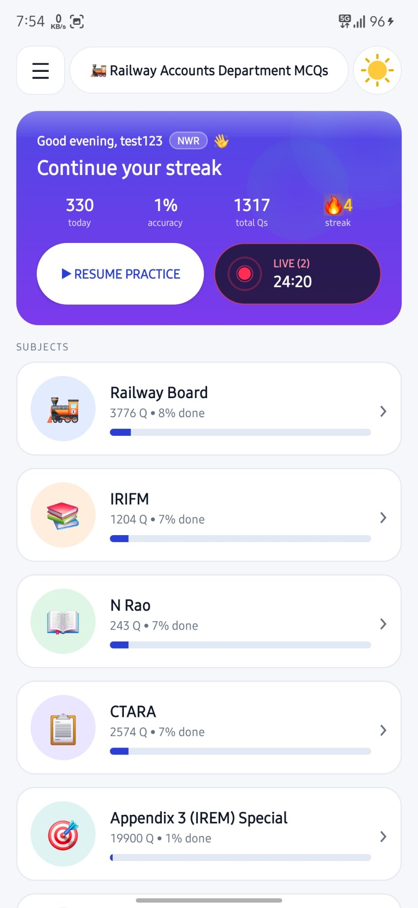 |

The navigation **drawer** shows your profile, day streak, level, access duration pill, and links to Home, My Performance, Sr.AI'so, Forum, Contact Us, About App.

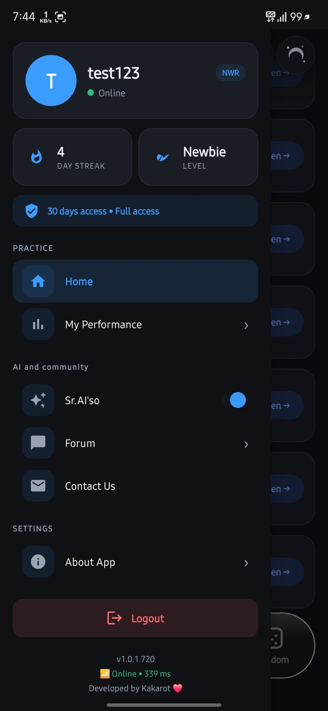

### ❓ Quiz Question
Rapid mode with instant answer reveal (green ✓), **Explanation** card with EN/HIN toggle, **Sr.AI'so** follow-up, per-question timer, bookmark, and Prev/Next navigation.

| Explanation (Hindi) | Explanation (English) | Explanation (Gemini) | Timer |
|---|---|---|---|
| 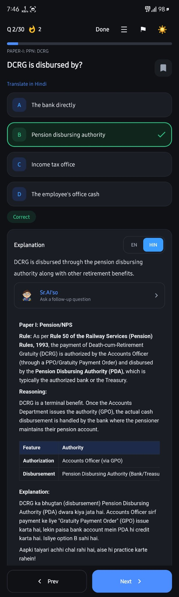 | 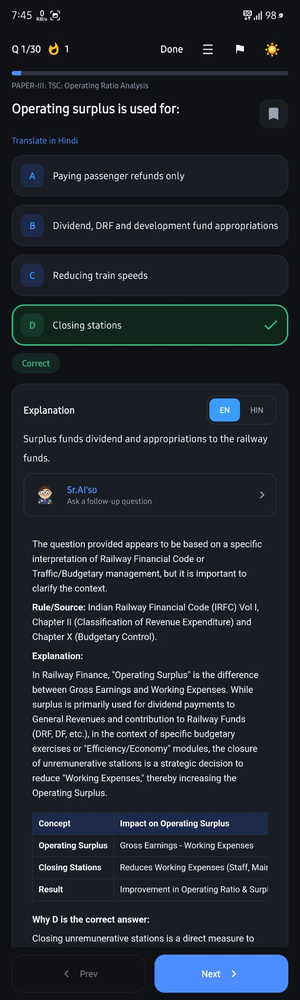 | 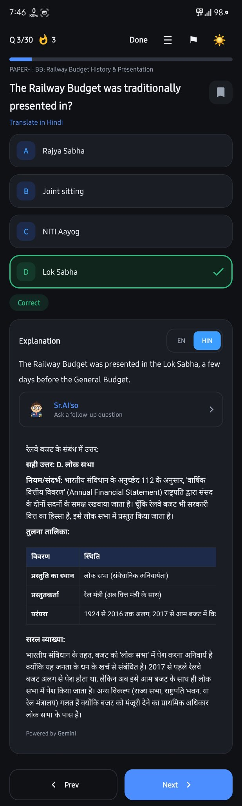 | 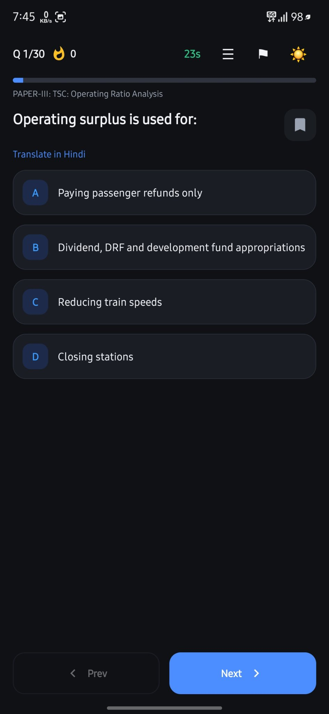 |

### 📝 Practice Sets, Topics & Random Quiz
Chapter-wise **Practice Sets** (50 questions each), topic lists with Attempted/Remaining counts, and **Random Quiz** mixing questions across subjects.

| Practice Sets | Practice Sets | Railway Board Topics | IRIFM Topics | Random Quiz |
|---|---|---|---|---|
| 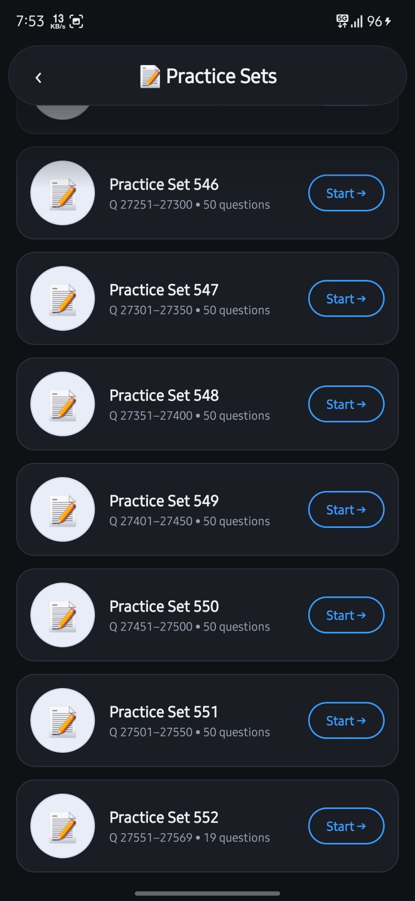 | 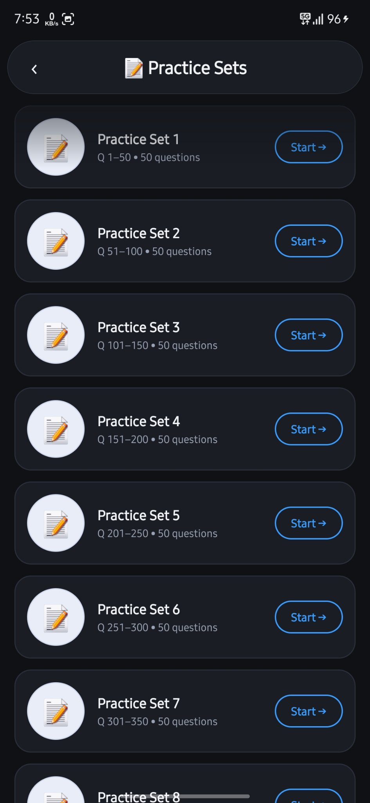 | 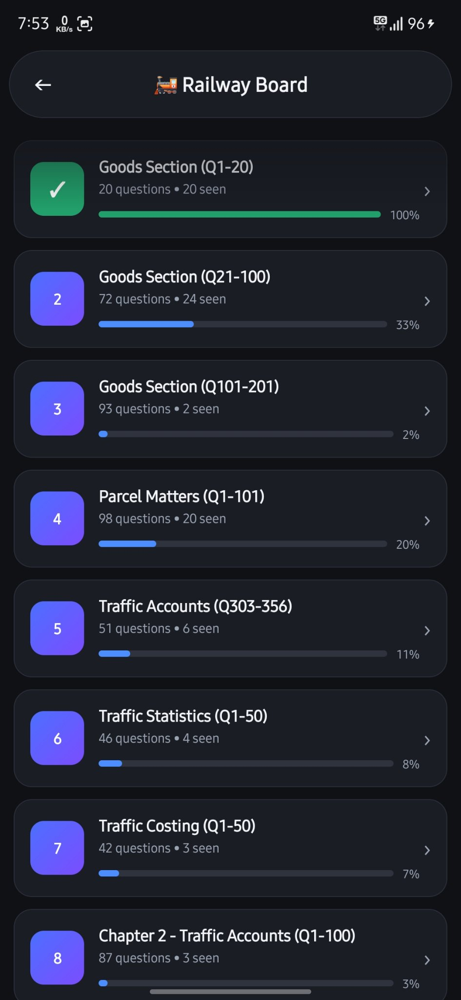 | 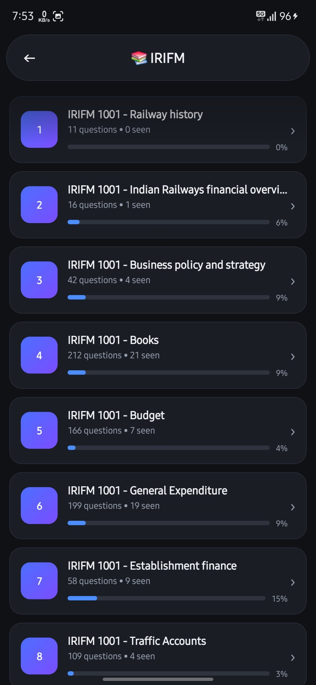 | 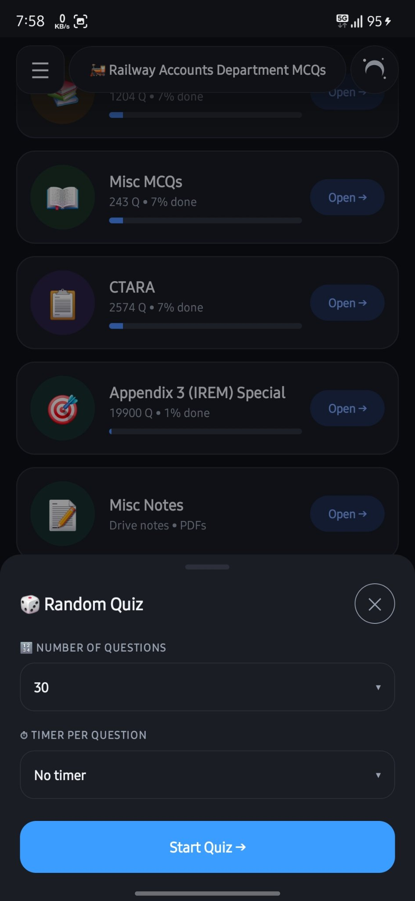 |

### 🎯 Appendix 3 (IREM) Special
**Paper-I** (6,440 Q), **Paper-II** (6,670 Q), **Paper-III** (6,790 Q) — tap a paper for a 100-question quiz or topic-wise study.

| Papers |
|---|
| 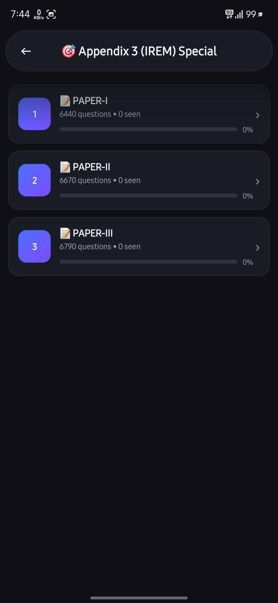 |

### ✨ AI Quizes
Admin-published quizzes on focused topics (Plan Heads, Statistics Code, Revenue, Stores Account, Pension…).

| AI Quizes |
|---|
| 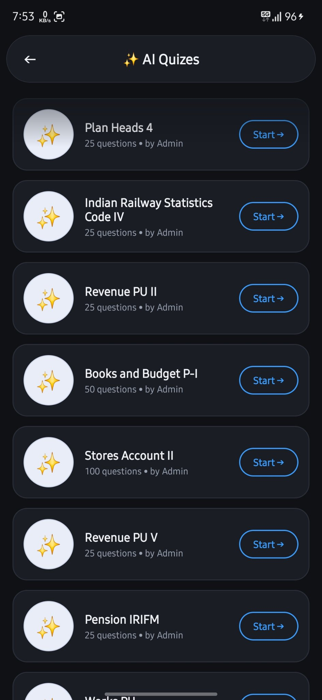 |

### 🤖 AI Assistant Sr.AI'so
Accounts-expert chatbot — ask anything (e.g. "Option Clause?", "LAP kya hai?") with your own API keys (Free/Groq/Gemini/OpenAI).

| AI Chat | AI Chat |
|---|---|
| 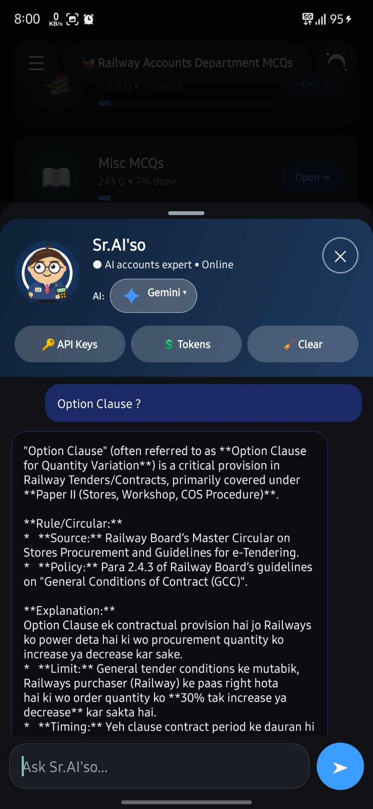 | 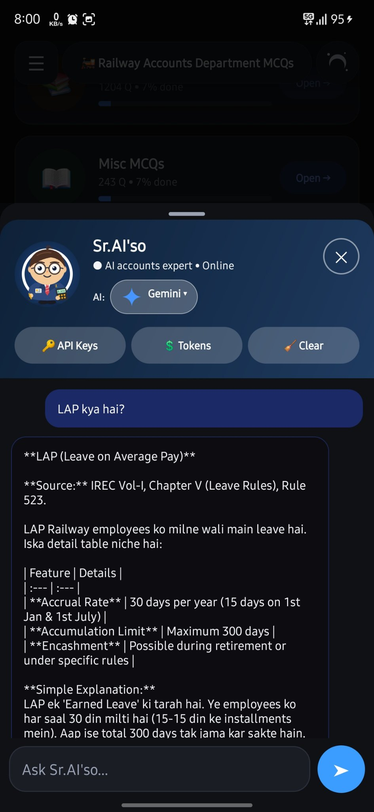 |

### 🔴 Live Quiz
Live-now quiz with Join button, upcoming scheduled quizzes, and past quiz history.

| Live Quiz |
|---|
| 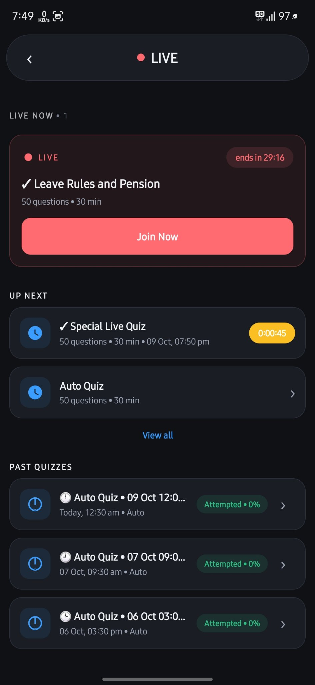 |

### 📊 My Performance
Accuracy donut, stat tiles, score-trend graph, per-mode averages, activity chart, and **Focus Areas** (weakest topics).

| My Performance |
|---|
| 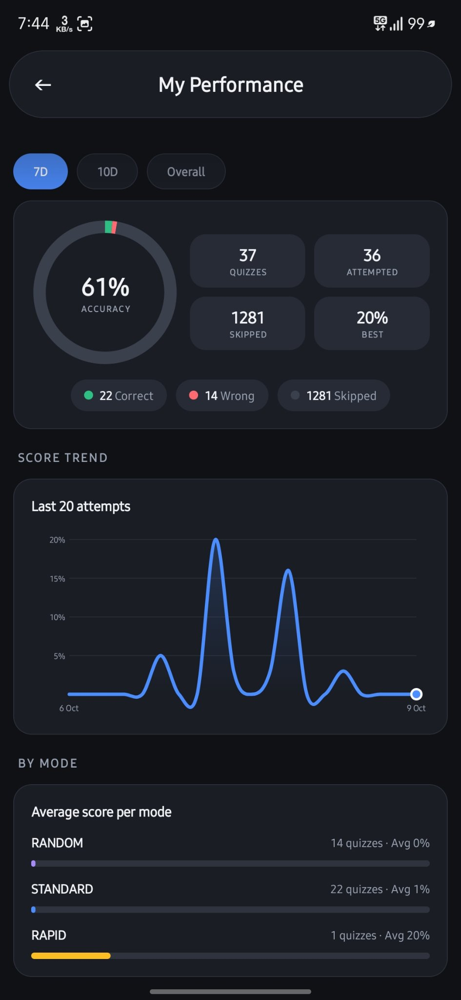 |

### 📝 Misc Notes
Subtopic-wise PDF notes from Drive.

| Misc Notes |
|---|
| 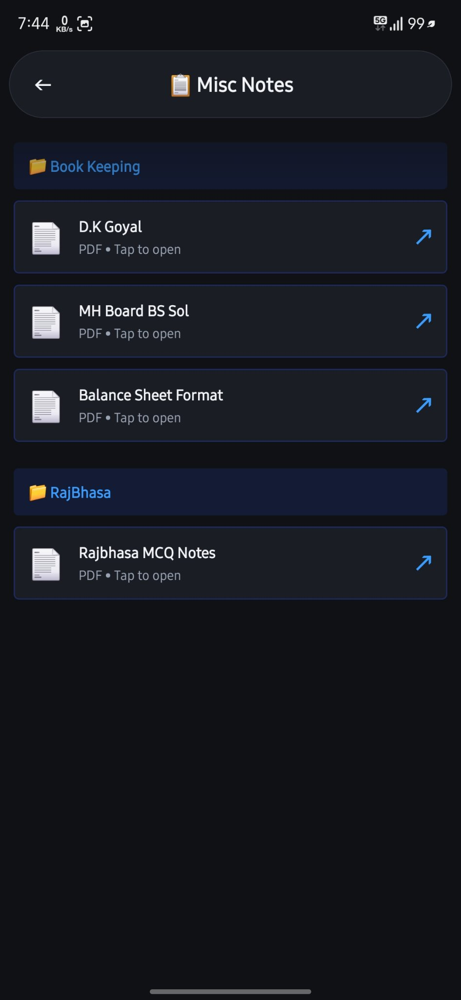 |

